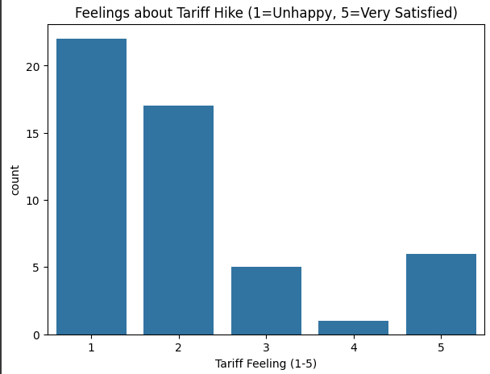
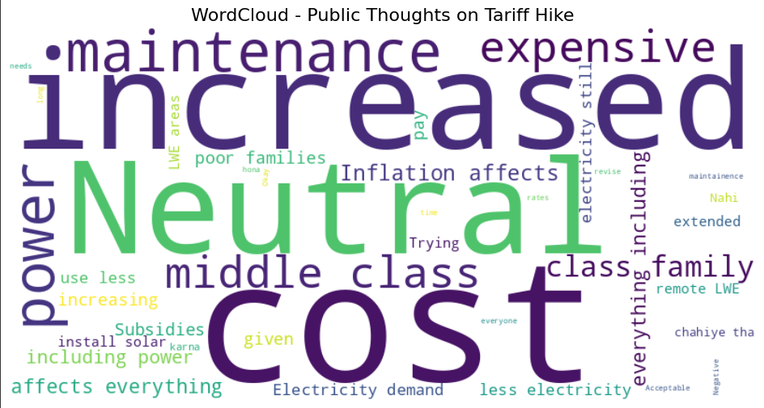

# ⚡ Electricity-Tariff-Sentiment-Analysis-Chhattisgarh-2025

The state of Chhattisgarh has announced new electricity tariffs for 2025–26, effective July 1, 2025, raising domestic rates by ₹0.10–0.20 per unit and impacting nearly 60 lakh consumers. Alongside the tariff hike, the state has introduced specific rebates, such as concessions for mobile towers in LWE-affected areas and hospitals in rural regions.

This project analyzes public sentiment towards recent electricity tariff hikes using survey data collected via **Google Forms**. The responses were preprocessed and classified using **Natural Language Processing (NLP)** and **Machine Learning** techniques into **positive, negative, and neutral sentiments**.

The analysis reveals that **majority sentiment is negative**, reflecting affordability concerns and dissatisfaction with government tariff policies. Neutral responses point to tariff hikes as an unavoidable necessity, while positive views were minimal, supporting tariff increases only if linked to better electricity supply and renewable adoption.

---

## ⚙️ Features

* Google Forms survey data collection  
* Text preprocessing (cleaning, tokenization, lemmatization, stopword removal)  
* Sentiment classification (Logistic Regression, Random Forest, etc.)  
* Data visualization (word clouds, sentiment distribution, keyword analysis)  
* Insights into **public perception of tariff policies**  

---

## 🛠️ Tech Stack

* **Languages:** Python  
* **Libraries:** Pandas, NumPy, Scikit-learn, NLTK, Matplotlib, Seaborn, WordCloud  
* **Environment:** Google Colab  

---

## 📊 Results & Inferences

### 🔹 Sentiment Distribution

* **Negative:** Majority of respondents, citing affordability burden and dissatisfaction.  
* **Neutral:** Some respondents accepted tariff hikes as necessary due to rising infrastructure costs.  
* **Positive:** Minimal support, linked to expected improvements in electricity quality and renewable energy adoption.  

  

---

### 🔹 Word Cloud

Frequently used terms include **bill, inflation, burden, government, affordability**.  

  

---

### 🔹 Key Insights

* Tariff hikes are perceived as a **financial burden** by most households.  
* Neutral perspectives consider them a **necessary step** for infrastructure improvement.  
* Very few participants had **positive outlooks**, conditional on **better service delivery**.  

---

## 🔮 Future Scope

* Apply advanced transformer-based models (e.g., BERT, mBERT) for multilingual sentiment analysis.  
* Expand survey coverage across more states and demographics.  
* Develop a **Streamlit dashboard** for real-time visualization.  

